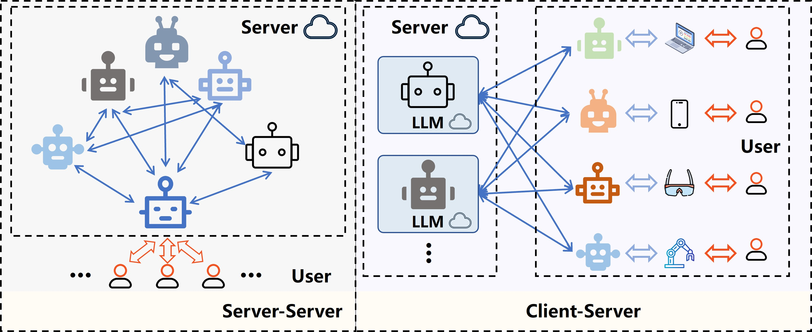

# **Co**llaboration in **L**arge-**M**odels(**CoLM**)

[](LICENSE)



<p align="center">
  <a href="#colM-overview"><strong>Overview</strong></a> ·
  <a href="#quick-start"><strong>Quick Start</strong></a> ·
  <a href="#evaluation"><strong>Evaluation</strong></a>
</p>

## Overview

**CoLM** (**Co**llaboration in **L**arge-**M**odels) is a novel framework designed for realistic **client-server deployment** scenarios, where multiple clients share access to a few powerful LLM servers.

Unlike ensemble or multi-agent LLM setups (server-to-server coordination), CoLM proposes a **client-to-server** collaboration strategy. Server models generate responses that **guide a lightweight client model**, enabling iterative refinement with significantly reduced inference cost.

This paradigm has been extended to both **language** and **vision-language** tasks, and shows consistent improvements on difficult or failed queries.

---

## Quick Start

###### 1. Environment Setup

Export your API keys as environment variables:

```bash
export OPENAI_API_KEY=your-openai-key
export DEEPSEEK_API_KEY=your-deepseek-key
export QWEN_API_KEY=your-qwen-key
```

###### 2.Run the script

`python CoLM.py`

###### 3. Customize your question

You can modify the `question` in the `__main__` block:

```
python
question = "What are the social and technical challenges of AI alignment?"
```

###### ⚙️ Parameters

The `main()` function supports the following arguments:

- `question`: Your input question.
- `use_selection`: Whether to use a big model (`gpt-4o`) to select the top-K relevant models.
- `iterations`: Number of refinement rounds.
- `top_k`: Number of models to select (if `use_selection=True`).

###### 📌 Example Models

The following specialized models are simulated in this project:

| Name          | Description                                      |
| ------------- | ------------------------------------------------ |
| `qwen-math`   | A math-focused assistant                         |
| `gpt-conv`    | A conversational and emotionally aware assistant |
| `qwen-coder`  | A helpful code assistant                         |
| `ds-creative` | A creative writing-focused assistant             |

These models can be replaced or extended with other endpoints and prompts.

###### Example Output

```
>>> Selected Models: ['gpt-conv', 'ds-creative']

>>> gpt-conv initial response: The Alignment Problem by Brian Christian explores...
...

=== Iteration 1: Refinement ===
...

=== Final Model Outputs ===
[gpt-conv]
The book presents real-world risks in AI development...
```

## Evaluation

To validate the effectiveness of our method, we conduct evaluations on three benchmark datasets: [AlpacaEval](https://github.com/tatsu-lab/alpaca_eval), [MT-Bench](https://github.com/lm-sys/FastChat), and [arena-hard](https://github.com/lmarena/arena-hard-auto).  We have integrated and adapted the code from these projects as needed, and we sincerely thank the authors for their contributions.

### Preparation

```bash
# install requirements
cd alpaca_eval
pip install -e .
cd FastChat
pip install -e ".[model_worker,llm_judge]"
```

### Run AlpacaEval

To run AlpacaEval, execute the following scripts:

```bash
python generate_alpaca.py

# For evaluation
export OPENAI_API_KEY=<your_api_key>  # for more complex configs, e.g. using Azure or switching clients see alpaca_eval/client_configs/README.md 
alpaca_eval --model_outputs 'example/outputs.json'
```

###### Important Parameters

- **`model_outputs`**:  A path to a JSON file for the outputs of the model to add to the leaderboard.  
  
  Each dictionary should contain the keys `instruction` and `output`.

- **`annotators_config`**:  
  
  The annotator to use. We recommend using `weighted_alpaca_eval_gpt4_turbo`  (default for AlpacaEval 2.0), which has a high agreement rate with human annotation data,  large context size, and low cost.  
  
- **`reference_outputs`**:  The outputs of the reference model. Same format as `model_outputs`.  By default, this is `gpt4_turbo` for AlpacaEval 2.0.
  
- **`output_path`**:  Path for saving annotations and leaderboard.

### Run MT-Bench

For MT-Bench evaluation, run:

```bash
python generate_mt_bench.py

python eval_mt_bench.py --model-list 'your model name'  --parallel 32

python show_mt_bench_result.py
```

### Run Arena Hard

---

###### 1. Update `api_config`

Add your new model with its corresponding `system_prompt` in the `api_config` file. Example:

```json
"your-model-id": {
  "api_type": "openai",
  "base_url": "https://api.openai.com/v1",
  "model_name": "your-model-id",
  "system_prompt": "You are a helpful assistant."
}
```

---

###### 2. Get answers

Add the new model's ID to the `model_list` in `gen_answer_config`:

```bash
python generate_arena.py
```

---

###### 3. Add to `judge_config` for Evaluation

Include the model ID in `model_list` under `judge_config` to enable automatic evaluation:

```bash
"model_list": [
  "gpt-3.5-turbo",
  "gpt-4o",
  "your-model-id"
]
python arena_hard_gen_judge.py
```

During the evaluation phase, the judgment results will be generated under `model_judgement/judge_model/` (e.g., `model_judgement/gpt-4o/your-model-id.jsonl`).

---

###### 4. View the Results

Once the evaluations are complete, run:

```bash
python arena_hard_show_results.py
```

This will display the leaderboard and detailed annotations for the newly added model.
